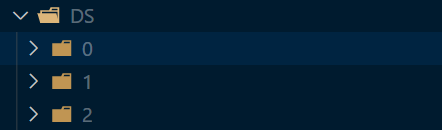

# ski-check

## usage

新功能已经完成，运行以下代码就可以训练数据集。

```
python3 train.py --datapath DS
```

数据集必须已经完成分类，分类方法为将每一类图片放至对应标签的文件夹下，如图



由于train.py使用了pytorch的resnet152，故在使用没有cuda的设备或cuda设备性能较差时，建议使用train_sug.py，参数一致。

事实上在使用train_sug.py时，不论是使用cpu还是gpu，效果都要好于resnet152，所以建议使用train_sug.py。

test.py包含了训练测试，可以测试训练模型的效果。

部分旧模块已合并，将原detect模块改名为yolo模块，将cut模块并入yolo中，将demo更命为pretreatment，capture模块并入pretreatment中。如要运行视频预处理部分，可以在终端输入

```
python3 pretreatment.py /your-videos-dir
```

